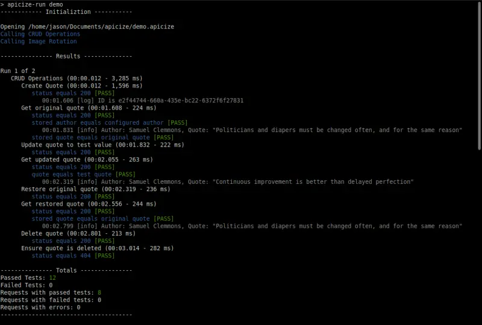
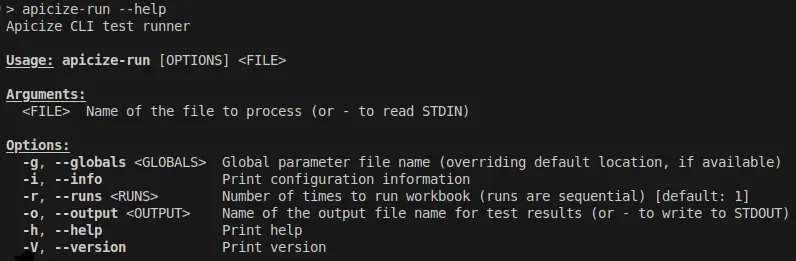
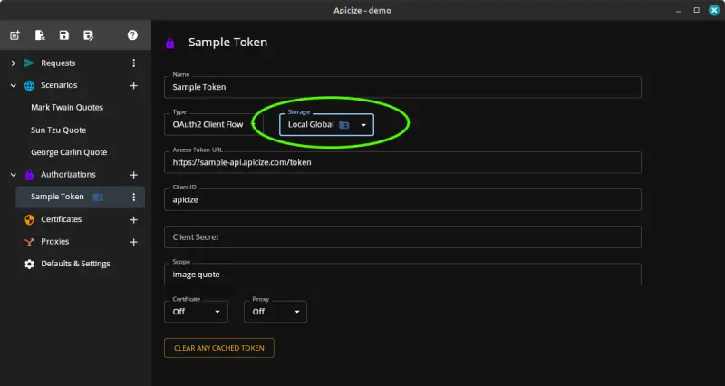
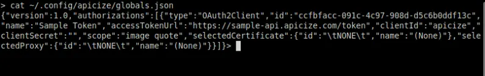

# Apicize CLI

The Apicize CLI, `apicize-run` is a command line interface application to run Apicize workbooks, dispatching requests and executing tests.



Upon execution, it will return the following values:

* Zero:  All requests were run and tests successful
* Greater than Zero:  Number of requests which either had unsuccessful requests or failed tests
* Less than Zero:  Program error

## Usage

Run `apicize-run [workbook]`, where `workbook` is the 

* `[workbook]: Name of the workbook you wish to run.  The workbook name may be a fully qualified path name, or just the name of a workbook located in the user's Apicize document directory.
* `--runs`: Run all workbook tests the specified number of times.  This is a top-level loop, all requests and groups will be executed the number of run based upon their definition within the loop
* `--seed <SEED DATA>`:  Executes workbook requests using the Seed data specified by name or path.
* `--output <OUTPUT>`:  Sends JSON-formatted test output to the file specified in `<OUTPUT>`.  Setting this value to a single hyphen ("-") will output test output to STDOUT, and progress information to STDERR.
* `--globals <GLOBALS>`:  Specifies location of global parameters file containing scenarios, authentications, certificates, proxies
* `--validate`:  Validate workbook file
* `--info`: Print information about location of global parameters and default workbooks directory
* `--help`: Print help information
* `--version`: Print version



## CI/CD Strategy

Running a workbook using this tool is simple, run `apicize-run` followed by the path to a workbook.  If your workbook relies upon parameters like authorizations which are not stored
in the workbook, you can create a global parameters file that contains such parameters.  The easiest way to create the file is to use the [Apicize UI](https://github.com/apicize/app)
to define these parametesr, create secret (or similar mechanism) to hold that information in your CI/CD project and save it as a file during execution.



Global parameters are stored in a file called `globals.json` in the user's configuration directory.  On Linux, this is `~/.config/apicize`, on Windows, this is `c:\Users\(name)\AppData\Roaming\apicize`. 
If you have to search for the file, it will contain data like this:



Once your pipeline saves this file, you can use the `--globals` parameter to refer to it an pull in values.

Note that parameters can be matched by Name, as well as ID.

## Dockerfile install

```dockerfile
#############################################################################
# Install Apicize
#############################################################################
RUN wget https://github.com/apicize/cli/releases/download/apicize-cli-v0.21.3/Apicize-run_0.21.3_amd64.deb
RUN apt install ./Apicize-run_0.21.3_amd64.deb
RUN rm -f Apicize-run_0.21.3_amd64.deb
```


## To-Do

* Create Windows and MacOS executables and installers


