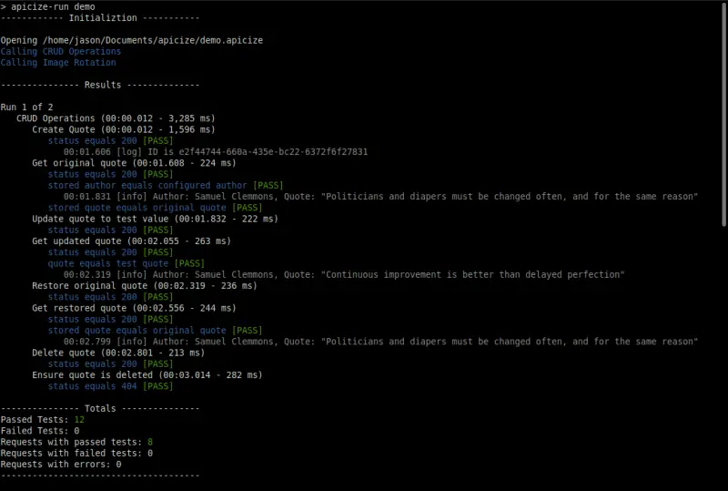
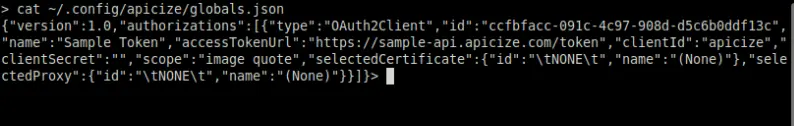

# Apicize CLI

The Apicize CLI, `apicize-run` is a command line interface application to run [Apicize](https://github.com/apicize/app) workbooks, dispatching requests and executing tests.

Upon execution, it will return the following values:

* Zero:  All requests were run and tests successful
* Greater than Zero:  Number of requests which either had unsuccessful requests or failed tests
* Less than Zero:  Program error

## Usage

`apicize-run [OPTIONS] <FILE>`

**Arguments:**

* `<FILE>`  Name of the workbook file to process (or `-` to read workbook from STDIN)

**Options:**
      
* `--runs <RUNS>` \
  Number of times to run workbook (runs are sequential) [default: 1]
* `-o`, `--output <OUTPUT>` \
  Name of the output file name for test results (or - to write to STDOUT)
* `--filter <CRITERIA>` \
  Limits requests/groups to those with ID or name that exactly match CRITERIA, or fuzzy match name and are not disabled
* `--report-json <REPORT_JSON>` \
  File name for JSON report
* `--report-csv <REPORT_CSV>` \
  File name for CSV report
* `-t`, `--trace <TRACE>` \
  Name of the output file name for tracing HTTP traffic
* `-g`, `--globals <GLOBALS>` \
  Global parameter ("vault") file name (overriding default location, if available)
* `-d`, `--data <DATA>` \
  Name of data set entry, or relative path to seed file from input stream
* `--default-scenario <DEFAULT_SCENARIO>` \
  Default certificate (ID or name) to use for requests
* `--default-authorization <DEFAULT_AUTHORIZATION>` \
  Default authorization (ID or name) to use for requests
* `--default-certificate <DEFAULT_CERTIFICATE>` \
  Default certificate (ID or name) to use for requests
* `--default-proxy <DEFAULT_PROXY>` \
  Default proxy (ID or name) to use for requests
* `--private-password <PRIVATE_PASSWORD>` \
  Password for Workbook private parameter file
* `--vault-password <VAULT_PASSWORD>` \
  Password for Vault global  parameter file
* `--validate` \
  If set, the script and arguments will be validated but tests will not be run
* `--no-color` \
  If set, output will not use color
* `--info` \
  Print configuration information
* -h, --help \
  Print help
* -V, --version \
  Print version

## CI/CD Strategy

Running a workbook using this tool is simple, run `apicize-run` followed by the path to a workbook.  If your workbook relies upon parameters like authorizations which are not stored
in the workbook, you can create a global parameters file that contains such parameters.  The easiest way to create the file is to use the [Apicize UI](https://github.com/apicize/app)
to define these parametesr, create secret (or similar mechanism) to hold that information in your CI/CD project and save it as a file during execution.

Global parameters are stored in a file called `globals.json` in the user's configuration directory.  On Linux, this is `~/.config/apicize`, on Windows, this is `c:\Users\(name)\AppData\Roaming\apicize`. 
If you have to search for the file, it will contain data like this:

Once your pipeline saves this file, you can use the `--globals` parameter to refer to it an pull in values.

Note that parameters can be matched by Name, as well as ID, so the IDs in your globals file do not have to match the workbooks, along as the names do.
